<!-- ╔════════════════════════════════════════════════════════════════╗
     ║   PROFILE: MATEUS HENRIQUE  ·  BUILD: v3.0  ·  STATUS: ONLINE   ║
     ╚════════════════════════════════════════════════════════════════╝ -->

  

  

  
  
  
  

<h2 align="center">⌨️ BOOT_SEQUENCE</h2>

  

<h2 align="center">⚡ TECH_ARSENAL</h2>

  

 

  
  
  
  
  

<h2 align="center">🛰️ ACTIVE_DEPLOYMENTS</h2>

<table align="center" width="100%">
  <tr>
    <td align="center" width="50%">
      <h3>🔷 VOX Solutions</h3>
      
Soluções tecnológicas customizadas — do diagnóstico do problema ao deploy em produção.

      

        
        
        
      

    </td>
    <td align="center" width="50%">
      <h3>⚙️ HG Tech</h3>
      
Software house focada em alta performance — produtos digitais sob medida.

      

        
        
        
      

    </td>
  </tr>
  <tr>
    <td align="center" colspan="2">
      <h3>🧠 HG Hub</h3>
      
Plataforma SaaS de automação e CRM — infraestrutura de crescimento para negócios escaláveis.

      

        
        
        
        
        
      

    </td>
  </tr>
</table>

<h2 align="center">📊 PERFORMANCE_METRICS</h2>

  
  

 

  

 

  

<h2 align="center">🏆 ACHIEVEMENTS_UNLOCKED</h2>

  

<h2 align="center">🐍 CONTRIBUTION_HUNTER</h2>

  <picture>
    <source media="(prefers-color-scheme: dark)" srcset="https://raw.githubusercontent.com/Rickteuz/Rickteuz/output/github-contribution-grid-snake-dark.svg"/>
    <source media="(prefers-color-scheme: light)" srcset="https://raw.githubusercontent.com/Rickteuz/Rickteuz/output/github-contribution-grid-snake.svg"/>
    
  </picture>

<h2 align="center">📡 ESTABLISH_CONNECTION</h2>

  
  
  

 

  

<!-- console.log("Se você leu o código-fonte até aqui, já merece um follow. 🟢") -->
